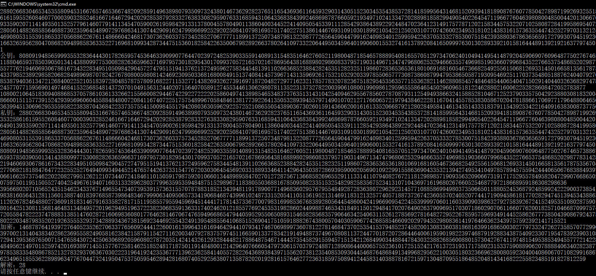

# encryption

(1)Des.zip
调用DES分组密码源程序中的相关函数，设计支持CBC模式的一个文件加密器，可以加密任意长度的文件，并密文文件可解密还原回原明文文件

(2)rsa.zip
利用MPIR大整数运算库函数，实现RSA公钥加密算法。要求:1）RSA模数为2048bit；2）能对一个数据（例如，16进制数“1234567890ABCDEF”）进行加密、解密。

(3)rsa_qianming.zip
利用MPIR大整数运算库函数，实现RSA数字算法。要求:1）RSA模数为2048bit；2）能对任意文件进行签名、验证（调用MD5散列函数求文件的散列值，再对散列值进行签名）。

如何使用MD5算法:见MD5.rar

[PS:如何在vs下添加.h和.lib][1]

[1]: https://blog.csdn.net/u012319493/article/details/54377501
